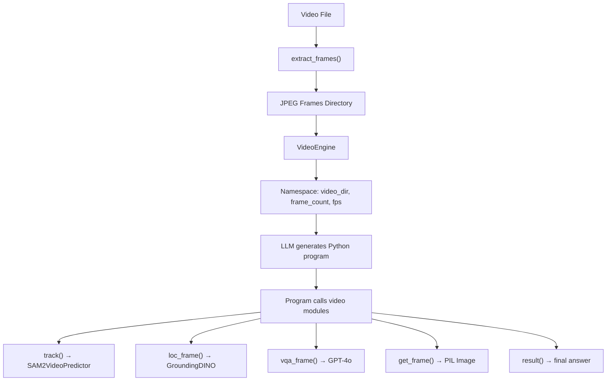

# VADAR Video Analysis Extension Walkthrough

Extended VADAR from image-only analysis to **video analysis** by unlocking SAM 2's Video Predictor and adding a complete video processing pipeline.

## Summary of Changes

### New Infrastructure
- **[video_utils.py](file:///c:/Users/Admin/VADAR_Video/engine/video_utils.py)**: Frame extraction, video metadata, chunked processing, frame loading, and mask→bbox conversion.
- **[video_engine.py](file:///c:/Users/Admin/VADAR_Video/engine/video_engine.py)**: `VideoEngine` class for extracting frames and providing context (`video_dir`, `frame_count`, `fps`) to LLM programs.

### Enhanced Logic
- **[predefined_modules.py](file:///c:/Users/Admin/VADAR_Video/engine/predefined_modules.py)**: Added `SAM2VideoPredictor` and 6 new classes: `VideoTrackModule`, `VideoLocateModule`, `VideoVQAModule`, `VideoGetFrameModule`, `VideoResultModule`, and `VideoModulesList`.
- **[modules.py](file:///c:/Users/Admin/VADAR_Video/prompts/modules.py)**: Added API docstrings for `get_frame`, `track`, `loc_frame`, `vqa_frame`, and `result`.
- **[program_prompt.py](file:///c:/Users/Admin/VADAR_Video/prompts/program_prompt.py)**: Added 5 few-shot examples teaching the LLM to write video analysis programs.

## Architecture

## Key Design Decisions

1.  **Unified SAM 2 Checkpoint**: Uses the same model weights for both image and video modes, just wrapped in the appropriate predictor.
2.  **Auto-chunking**: `VideoModulesList._auto_chunk_size()` detects GPU VRAM and sets chunk size accordingly (None for ≥24GB, 100 for 16GB, 50 for 8GB).
3.  **Module Delegation**: Video modules wrap existing image modules where possible (e.g., `VideoLocateModule` wraps `LocateModule`).
4.  **Temporal Context**: The LLM receives temporal variables (`video_dir`, `frame_count`, `fps`) instead of a static image.

## Next Steps
- Interactive testing with a demo notebook.
- End-to-end verification with sample video assets.
